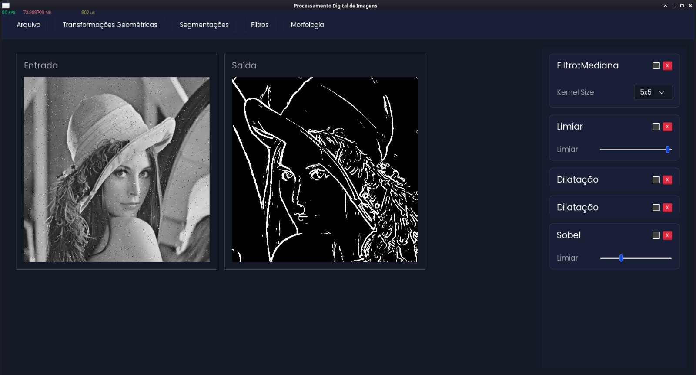
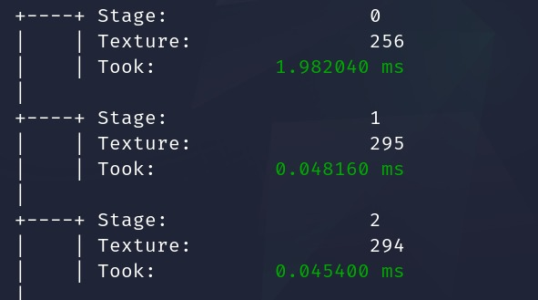

# Image Processing - OpenGL Powered Tool

> **⚠️ This project uses a custom OpenGL-based UI framework built entirely by me from scratch.**  
> It was developed **alongside** this image processing software as part of my university class work.

---

This repository is part of a project for a university Image Processing course.

I designed and developed an **OpenGL-based 2D UI framework** in C++ to support the creation of this tool. The framework handles windowing, input, UI components, drawing, and text rendering—everything built from the ground up using raw OpenGL (no ImGui, no SDL, no Qt). It is extremely lightweight and designed for performance, learning, and *almost* full control of rendering.

---

## ✨ Features

- ⚙️ **Custom OpenGL UI Framework**
- 🖼️ Real-time image processing
- 📥 Loads images via stbi
- 💨 Hardware-accelerated (uses GPU shaders over CPU)
- 🌀 Multipass ping-pong FBO system
- 💻 Linux-first (GLFW + X11 tested on Debian)

---

## 🧪 Software Screenshot



---

## 🚀 Performance: CPU vs GPU

Before settling on shaders, I attempted to implement the processing pipeline in **three different CPU strategies**:

- Plain single-threaded C++
- Multi-threading using std::thread
- AVX512 SIMD instructions (manual and with intrinsics)

While each method had its merits, **none of them came remotely close to the performance of my OpenGL shader-based approach**. Even with AVX512 vectorization, the CPU consistently lagged behind, especially on large images and complex filters.

---

## 🎯 Final Architecture: Multipass Shader Pipeline

Ultimately, I implemented a **multi-pass shader pipeline** using **ping-pong Framebuffer Objects (FBOs)**. This allows applying multiple image effects (filters, blurs, edge detection, etc.) in succession **without ever reading pixels back to the CPU** and with **no performance degradation**.

### ⬇️ Console timing log for `screenshot.jpeg`:

*Soon i'll insert a pretty console print here XD*



---

## 📦 Build & Run

Make sure you have the required libraries installed:

```bash
    sudo apt install libglfw3-dev libfreetype6-dev libx11-dev
```
Then you can just build the source. Note: The first compilation **may take some time** to link all the dependencies. 

```bash
    make
```


